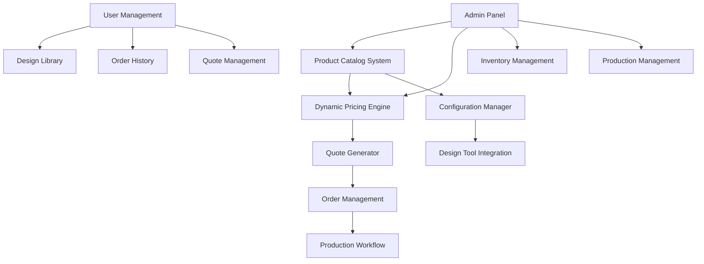
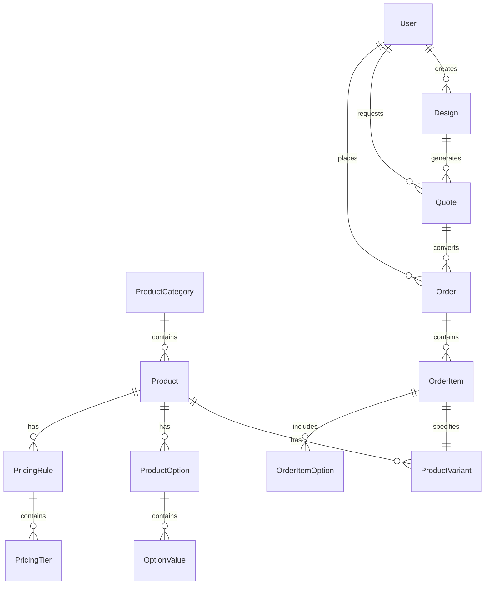

# Design Document

## Overview

This design outlines the migration and enhancement of creativeprintarts.com functionality into the current Django-based printing platform. The system will maintain all existing product offerings while leveraging modern technology including the integrated design tool, enhanced user management, and improved UI/UX. The architecture supports complex product configurations, dynamic pricing, and seamless integration with the existing design workflow.

## Architecture

### High-Level System Architecture



### Database Architecture



## Components and Interfaces

### 1. Enhanced Product Catalog System

**Purpose**: Manage comprehensive product catalog with all specifications from the old site.

**Core Models**:

```python
class ProductCategory(models.Model):
    name = models.CharField(max_length=100)
    slug = models.SlugField(unique=True)
    description = models.TextField()
    image = models.ImageField()
    sort_order = models.IntegerField(default=0)
    is_active = models.BooleanField(default=True)
    
    # SEO and display
    meta_title = models.CharField(max_length=200)
    meta_description = models.TextField()
    
class Product(models.Model):
    category = models.ForeignKey(ProductCategory, on_delete=models.CASCADE)
    name = models.CharField(max_length=200)
    slug = models.SlugField(unique=True)
    description = models.TextField()
    short_description = models.CharField(max_length=500)
    
    # Base specifications
    base_width = models.DecimalField(max_digits=8, decimal_places=2)
    base_height = models.DecimalField(max_digits=8, decimal_places=2)
    unit = models.CharField(max_length=10, choices=[('mm', 'MM'), ('in', 'Inches')])
    
    # Pricing
    base_price = models.DecimalField(max_digits=10, decimal_places=2)
    minimum_quantity = models.IntegerField(default=1)
    
    # Design tool integration
    has_design_tool = models.BooleanField(default=True)
    default_bleed = models.DecimalField(max_digits=5, decimal_places=2, default=3.0)
    default_safe_zone = models.DecimalField(max_digits=5, decimal_places=2, default=2.0)
    
    # Production
    production_time_days = models.IntegerField(default=3)
    is_active = models.BooleanField(default=True)

class ProductVariant(models.Model):
    product = models.ForeignKey(Product, on_delete=models.CASCADE)
    name = models.CharField(max_length=100)
    sku = models.CharField(max_length=50, unique=True)
    
    # Dimensions
    width = models.DecimalField(max_digits=8, decimal_places=2)
    height = models.DecimalField(max_digits=8, decimal_places=2)
    
    # Pricing modifiers
    price_modifier = models.DecimalField(max_digits=8, decimal_places=2, default=0)
    price_modifier_type = models.CharField(max_length=10, choices=[
        ('fixed', 'Fixed Amount'),
        ('percent', 'Percentage')
    ])
    
class ProductOption(models.Model):
    OPTION_TYPES = [
        ('paper', 'Paper Type'),
        ('finish', 'Finish'),
        ('binding', 'Binding'),
        ('color', 'Color Mode'),
        ('quantity', 'Quantity'),
        ('size', 'Size'),
        ('coating', 'Coating'),
        ('corners', 'Corner Style'),
    ]
    
    product = models.ForeignKey(Product, on_delete=models.CASCADE)
    name = models.CharField(max_length=100)
    option_type = models.CharField(max_length=20, choices=OPTION_TYPES)
    is_required = models.BooleanField(default=True)
    sort_order = models.IntegerField(default=0)

class OptionValue(models.Model):
    option = models.ForeignKey(ProductOption, on_delete=models.CASCADE)
    name = models.CharField(max_length=100)
    description = models.TextField(blank=True)
    
    # Pricing
    price_modifier = models.DecimalField(max_digits=8, decimal_places=2, default=0)
    price_modifier_type = models.CharField(max_length=10, choices=[
        ('fixed', 'Fixed Amount'),
        ('percent', 'Percentage')
    ])
    
    # Visual representation
    image = models.ImageField(blank=True, null=True)
    color_code = models.CharField(max_length=7, blank=True)  # Hex color
    
    # Specifications
    specifications = models.JSONField(default=dict)  # Store technical specs
    is_default = models.BooleanField(default=False)
    sort_order = models.IntegerField(default=0)
```

### 2. Dynamic Pricing Engine

**Purpose**: Handle complex pricing calculations including quantity breaks, option surcharges, and regional pricing.

```python
class PricingRule(models.Model):
    RULE_TYPES = [
        ('base', 'Base Price'),
        ('quantity', 'Quantity Break'),
        ('option', 'Option Surcharge'),
        ('regional', 'Regional Pricing'),
        ('bulk', 'Bulk Discount'),
    ]
    
    product = models.ForeignKey(Product, on_delete=models.CASCADE)
    rule_type = models.CharField(max_length=20, choices=RULE_TYPES)
    name = models.CharField(max_length=100)
    is_active = models.BooleanField(default=True)
    priority = models.IntegerField(default=0)
    
    # Conditions
    min_quantity = models.IntegerField(null=True, blank=True)
    max_quantity = models.IntegerField(null=True, blank=True)
    required_options = models.JSONField(default=list)  # List of required option combinations
    
class PricingTier(models.Model):
    pricing_rule = models.ForeignKey(PricingRule, on_delete=models.CASCADE)
    min_quantity = models.IntegerField()
    max_quantity = models.IntegerField(null=True, blank=True)
    
    # Pricing
    unit_price = models.DecimalField(max_digits=10, decimal_places=4)
    setup_fee = models.DecimalField(max_digits=8, decimal_places=2, default=0)
    
class PricingCalculator:
    def calculate_price(self, product, variant, options, quantity):
        """
        Calculate total price based on product, variant, options, and quantity
        """
        base_price = self.get_base_price(product, variant)
        option_modifiers = self.calculate_option_modifiers(options)
        quantity_discount = self.calculate_quantity_discount(product, quantity)
        
        unit_price = (base_price + option_modifiers) * (1 - quantity_discount)
        total_price = unit_price * quantity
        
        return {
            'unit_price': unit_price,
            'total_price': total_price,
            'base_price': base_price,
            'option_modifiers': option_modifiers,
            'quantity_discount': quantity_discount,
            'breakdown': self.get_price_breakdown(product, variant, options, quantity)
        }
```

### 3. Enhanced Quote System

**Purpose**: Generate detailed quotes with all specifications and pricing breakdowns.

```python
class Quote(models.Model):
    STATUS_CHOICES = [
        ('draft', 'Draft'),
        ('sent', 'Sent'),
        ('approved', 'Approved'),
        ('rejected', 'Rejected'),
        ('expired', 'Expired'),
        ('converted', 'Converted to Order'),
    ]
    
    user = models.ForeignKey(User, on_delete=models.CASCADE)
    quote_number = models.CharField(max_length=20, unique=True)
    status = models.CharField(max_length=20, choices=STATUS_CHOICES, default='draft')
    
    # Pricing
    subtotal = models.DecimalField(max_digits=12, decimal_places=2)
    tax_amount = models.DecimalField(max_digits=10, decimal_places=2, default=0)
    shipping_amount = models.DecimalField(max_digits=10, decimal_places=2, default=0)
    total_amount = models.DecimalField(max_digits=12, decimal_places=2)
    
    # Validity
    valid_until = models.DateTimeField()
    created_at = models.DateTimeField(auto_now_add=True)
    updated_at = models.DateTimeField(auto_now=True)
    
    # Notes and specifications
    notes = models.TextField(blank=True)
    specifications = models.JSONField(default=dict)

class QuoteItem(models.Model):
    quote = models.ForeignKey(Quote, on_delete=models.CASCADE)
    product = models.ForeignKey(Product, on_delete=models.CASCADE)
    variant = models.ForeignKey(ProductVariant, on_delete=models.CASCADE, null=True)
    
    quantity = models.IntegerField()
    unit_price = models.DecimalField(max_digits=10, decimal_places=4)
    total_price = models.DecimalField(max_digits=12, decimal_places=2)
    
    # Design association
    design = models.ForeignKey('Design', on_delete=models.SET_NULL, null=True, blank=True)
    
    # Specifications
    specifications = models.JSONField(default=dict)
    selected_options = models.JSONField(default=dict)

class QuoteItemOption(models.Model):
    quote_item = models.ForeignKey(QuoteItem, on_delete=models.CASCADE)
    option = models.ForeignKey(ProductOption, on_delete=models.CASCADE)
    value = models.ForeignKey(OptionValue, on_delete=models.CASCADE)
    price_modifier = models.DecimalField(max_digits=8, decimal_places=2, default=0)
```

### 4. Design Tool Integration

**Purpose**: Seamlessly integrate the design tool with product specifications and pricing.

```python
class Design(models.Model):
    user = models.ForeignKey(User, on_delete=models.CASCADE)
    name = models.CharField(max_length=200)
    
    # Product association
    product = models.ForeignKey(Product, on_delete=models.CASCADE)
    variant = models.ForeignKey(ProductVariant, on_delete=models.CASCADE, null=True)
    
    # Design data
    canvas_data = models.JSONField()  # Fabric.js canvas data
    preview_image = models.ImageField()
    
    # Specifications
    width = models.DecimalField(max_digits=8, decimal_places=2)
    height = models.DecimalField(max_digits=8, decimal_places=2)
    bleed = models.DecimalField(max_digits=5, decimal_places=2)
    safe_zone = models.DecimalField(max_digits=5, decimal_places=2)
    
    # Status
    is_template = models.BooleanField(default=False)
    is_public = models.BooleanField(default=False)
    created_at = models.DateTimeField(auto_now_add=True)
    updated_at = models.DateTimeField(auto_now=True)

class DesignToolIntegration:
    def configure_canvas_for_product(self, product, variant=None):
        """
        Configure design tool canvas based on product specifications
        """
        dimensions = self.get_product_dimensions(product, variant)
        
        return {
            'width': dimensions['width'],
            'height': dimensions['height'],
            'bleed': product.default_bleed,
            'safe_zone': product.default_safe_zone,
            'dpi': 300,
            'color_mode': self.get_color_mode(product),
            'templates': self.get_product_templates(product)
        }
    
    def update_pricing_on_design_change(self, design, options):
        """
        Update pricing when design specifications change
        """
        calculator = PricingCalculator()
        return calculator.calculate_price(
            design.product,
            design.variant,
            options,
            1  # Base quantity for design preview
        )
```

### 5. Enhanced Order Management

**Purpose**: Handle complex orders with multiple items, specifications, and production requirements.

```python
class Order(models.Model):
    STATUS_CHOICES = [
        ('pending', 'Pending Payment'),
        ('paid', 'Paid'),
        ('processing', 'Processing'),
        ('production', 'In Production'),
        ('quality_check', 'Quality Check'),
        ('shipping', 'Shipping'),
        ('delivered', 'Delivered'),
        ('cancelled', 'Cancelled'),
    ]
    
    user = models.ForeignKey(User, on_delete=models.CASCADE)
    order_number = models.CharField(max_length=20, unique=True)
    status = models.CharField(max_length=20, choices=STATUS_CHOICES, default='pending')
    
    # Converted from quote
    quote = models.ForeignKey(Quote, on_delete=models.SET_NULL, null=True, blank=True)
    
    # Pricing
    subtotal = models.DecimalField(max_digits=12, decimal_places=2)
    tax_amount = models.DecimalField(max_digits=10, decimal_places=2)
    shipping_amount = models.DecimalField(max_digits=10, decimal_places=2)
    total_amount = models.DecimalField(max_digits=12, decimal_places=2)
    
    # Delivery
    estimated_delivery = models.DateTimeField()
    actual_delivery = models.DateTimeField(null=True, blank=True)
    
    # Addresses
    billing_address = models.JSONField()
    shipping_address = models.JSONField()
    
    created_at = models.DateTimeField(auto_now_add=True)
    updated_at = models.DateTimeField(auto_now=True)

class OrderItem(models.Model):
    order = models.ForeignKey(Order, on_delete=models.CASCADE)
    product = models.ForeignKey(Product, on_delete=models.CASCADE)
    variant = models.ForeignKey(ProductVariant, on_delete=models.CASCADE, null=True)
    design = models.ForeignKey(Design, on_delete=models.SET_NULL, null=True)
    
    quantity = models.IntegerField()
    unit_price = models.DecimalField(max_digits=10, decimal_places=4)
    total_price = models.DecimalField(max_digits=12, decimal_places=2)
    
    # Production specifications
    specifications = models.JSONField(default=dict)
    production_notes = models.TextField(blank=True)
    
    # Files
    artwork_files = models.JSONField(default=list)  # List of file URLs
    proof_files = models.JSONField(default=list)    # Proof files
```

## Data Models

### Product Catalog Schema

The product catalog supports:
- **Hierarchical categories** with unlimited depth
- **Flexible product variants** (sizes, materials, etc.)
- **Complex option systems** with dependencies
- **Rich media support** (images, videos, 3D previews)
- **SEO optimization** with meta tags and structured data

### Pricing Schema

The pricing system handles:
- **Multi-tier quantity breaks** with custom ranges
- **Option-based surcharges** with complex rules
- **Regional pricing** for different markets
- **Bulk discounts** and promotional pricing
- **Dynamic pricing** based on material costs

### User Experience Schema

Enhanced user features include:
- **Design library** with version control
- **Quote management** with approval workflows
- **Order tracking** with real-time updates
- **Reorder functionality** with saved configurations
- **Collaboration tools** for team projects

## Error Handling

### Product Configuration Errors
- **Invalid option combinations**: Validate option dependencies and conflicts
- **Pricing calculation errors**: Fallback to base pricing with error logging
- **Design tool integration errors**: Graceful degradation with manual specification entry

### Order Processing Errors
- **Payment failures**: Retry mechanisms and alternative payment methods
- **Production issues**: Automated notifications and status updates
- **Shipping problems**: Integration with shipping APIs for real-time tracking

### Data Migration Errors
- **Product import failures**: Detailed error reporting and manual review queue
- **Pricing rule conflicts**: Validation and approval workflow for complex rules
- **Design compatibility issues**: Automatic conversion with manual review option

## Testing Strategy

### Unit Tests
1. **Product Model Tests**: Validate all product configurations and relationships
2. **Pricing Calculator Tests**: Test all pricing scenarios and edge cases
3. **Design Tool Integration Tests**: Verify canvas configuration and pricing updates
4. **Order Processing Tests**: Test complete order lifecycle

### Integration Tests
1. **End-to-End Product Configuration**: From catalog browsing to order placement
2. **Design Tool Workflow**: Complete design creation and ordering process
3. **Quote to Order Conversion**: Seamless transition with data integrity
4. **Multi-Product Orders**: Complex orders with different specifications

### Performance Tests
1. **Catalog Loading**: Large product catalogs with complex filtering
2. **Pricing Calculations**: High-volume pricing calculations
3. **Design Tool Performance**: Large designs with complex elements
4. **Order Processing**: Concurrent order processing and status updates

### User Acceptance Tests
1. **Product Discovery**: Intuitive catalog navigation and search
2. **Configuration Workflow**: Easy product customization process
3. **Design Creation**: Seamless design tool integration
4. **Order Management**: Clear order tracking and management

## Implementation Phases

### Phase 1: Core Product Catalog (4-6 weeks)
- Product models and admin interface
- Basic pricing system
- Category management
- Product import tools

### Phase 2: Enhanced Pricing Engine (3-4 weeks)
- Complex pricing rules
- Quantity breaks and discounts
- Option-based pricing
- Regional pricing support

### Phase 3: Design Tool Integration (3-4 weeks)
- Product-specific canvas configuration
- Real-time pricing updates
- Design-to-order workflow
- Template system enhancement

### Phase 4: Quote and Order System (4-5 weeks)
- Enhanced quote generation
- Order processing workflow
- Payment integration
- Production management

### Phase 5: User Experience Enhancement (3-4 weeks)
- Advanced user dashboard
- Design library management
- Collaboration features
- Mobile optimization

### Phase 6: Migration and Testing (2-3 weeks)
- Data migration from old site
- Comprehensive testing
- Performance optimization
- Go-live preparation

## Migration Strategy

### Data Migration Approach
1. **Product Catalog Migration**: Automated import with manual verification
2. **Customer Data Migration**: Secure transfer with consent management
3. **Order History Migration**: Historical data preservation
4. **Design Asset Migration**: File conversion and optimization

### Rollout Strategy
1. **Soft Launch**: Limited user group testing
2. **Parallel Operation**: Run both systems temporarily
3. **Gradual Migration**: Phase-wise user migration
4. **Full Cutover**: Complete transition with monitoring

This comprehensive design ensures that all functionality from creativeprintarts.com is preserved and enhanced while leveraging the modern technology stack of the current project.