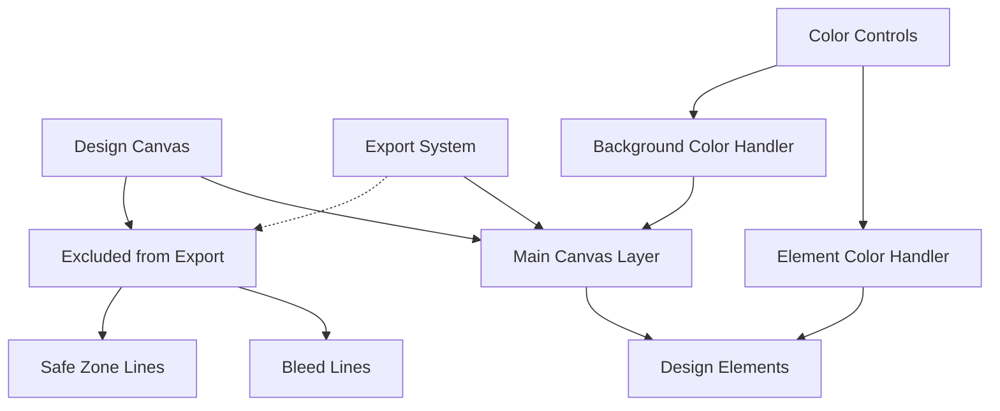

# Design Document

## Overview

This design addresses three critical issues in the design tool: guide lines being exported with designs, non-functional color picker controls, and non-functional background color controls. The solution involves separating guide lines into a non-exportable overlay system, fixing the color picker event handlers and element targeting, and ensuring proper background color management.

## Architecture

### High-Level Architecture



### Current Issues Analysis

1. **Export Issue**: Guide lines are currently drawn on the main Fabric.js canvas, making them part of the exportable content
2. **Color Picker Issue**: Event handlers may not be properly bound or element selection detection is failing
3. **Background Color Issue**: Background color changes may not be properly applied to the canvas or are being overridden

## Components and Interfaces

### 1. Guide Overlay System

**Purpose**: Separate guide lines from the main canvas to prevent export inclusion.

**Implementation Strategy**:
- Create a separate HTML5 canvas element positioned over the main Fabric.js canvas
- Draw guide lines on the overlay canvas instead of the main canvas
- Synchronize overlay positioning and scaling with main canvas transformations

**Interface**:
```javascript
class GuideOverlayManager {
    constructor(mainCanvas) {
        this.mainCanvas = mainCanvas;
        this.overlayCanvas = null;
        this.overlayContext = null;
        this.bleedLines = [];
        this.safeZoneLines = [];
        this.isVisible = true;
    }
    
    createOverlay() {
        // Creates overlay canvas positioned over main canvas
    }
    
    drawBleedLines(bleedConfig) {
        // Draws bleed lines on overlay canvas
    }
    
    drawSafeZoneLines(safeZoneConfig) {
        // Draws safe zone lines on overlay canvas
    }
    
    updateOverlay() {
        // Redraws all guide lines
    }
    
    syncWithMainCanvas() {
        // Synchronizes overlay position/scale with main canvas
    }
    
    toggleVisibility(visible) {
        // Shows/hides overlay canvas
    }
    
    clear() {
        // Clears all guide lines from overlay
    }
}
```

### 2. Enhanced Export System

**Purpose**: Export only the main canvas content, excluding guide overlays.

**Implementation Strategy**:
- Ensure export functions only target the main Fabric.js canvas
- Verify that overlay elements are not included in export operations
- Add export validation to confirm clean output

**Interface**:
```javascript
class ExportManager {
    constructor(mainCanvas, overlayManager) {
        this.mainCanvas = mainCanvas;
        this.overlayManager = overlayManager;
    }
    
    exportAsImage(format = 'png', quality = 1.0) {
        // Exports only main canvas content
        // Returns clean image without guide lines
    }
    
    exportAsPDF() {
        // Exports design as PDF without guides
    }
    
    validateExport(exportedData) {
        // Validates that export contains no guide elements
    }
    
    getExportPreview() {
        // Shows preview of what will be exported
    }
}
```

### 3. Color Control System

**Purpose**: Fix color picker functionality for design elements and canvas background.

**Implementation Strategy**:
- Properly bind event handlers to color picker elements
- Implement robust element selection detection
- Separate element color handling from background color handling
- Add visual feedback for color control states

**Interface**:
```javascript
class ColorControlManager {
    constructor(canvas) {
        this.canvas = canvas;
        this.elementColorPicker = null;
        this.backgroundColorPicker = null;
        this.selectedElements = [];
    }
    
    initializeColorControls() {
        // Binds event handlers to color picker elements
    }
    
    handleElementColorChange(color) {
        // Applies color to selected design elements
    }
    
    handleBackgroundColorChange(color) {
        // Changes canvas background color
    }
    
    updateSelectedElements() {
        // Updates list of currently selected elements
    }
    
    updateColorPickerState() {
        // Updates color picker UI based on selection
    }
    
    showColorFeedback(element, color) {
        // Provides visual feedback for color changes
    }
}
```

### 4. Canvas Background Manager

**Purpose**: Properly manage canvas background color changes.

**Implementation Strategy**:
- Use Fabric.js backgroundColor property correctly
- Ensure background changes don't affect design elements
- Maintain background color during canvas operations

**Interface**:
```javascript
class BackgroundManager {
    constructor(canvas) {
        this.canvas = canvas;
        this.currentBackgroundColor = '#ffffff';
    }
    
    setBackgroundColor(color) {
        // Sets canvas background color using Fabric.js API
    }
    
    getBackgroundColor() {
        // Returns current background color
    }
    
    resetBackground() {
        // Resets to default background color
    }
    
    preserveBackgroundDuringOperations() {
        // Ensures background persists during canvas operations
    }
}
```

## Data Models

### Guide Configuration Model
```javascript
class GuideConfiguration {
    constructor() {
        this.bleed = {
            enabled: true,
            size: 3, // mm
            color: '#ff0000',
            lineWidth: 1,
            dashPattern: [5, 5]
        };
        this.safeZone = {
            enabled: true,
            size: 5, // mm
            color: '#00ff00',
            lineWidth: 1,
            dashPattern: [3, 3]
        };
    }
    
    updateBleedConfig(config) {
        // Updates bleed line configuration
    }
    
    updateSafeZoneConfig(config) {
        // Updates safe zone configuration
    }
}
```

### Color State Model
```javascript
class ColorState {
    constructor() {
        this.selectedElementColor = null;
        this.backgroundColor = '#ffffff';
        this.hasSelection = false;
        this.multipleColorsSelected = false;
    }
    
    updateFromSelection(selectedObjects) {
        // Updates color state based on current selection
    }
    
    getDisplayColor() {
        // Returns appropriate color for UI display
    }
}
```

## Error Handling

### Guide Overlay Errors
- **Canvas Creation Failure**: Fallback to main canvas with export warnings
- **Positioning Issues**: Automatic repositioning and synchronization
- **Performance Issues**: Optimize redraw frequency and use requestAnimationFrame

### Color Control Errors
- **Element Selection Failure**: Clear error messages and fallback behavior
- **Color Application Failure**: Validation and rollback mechanisms
- **Event Handler Issues**: Robust event binding with error recovery

### Export Errors
- **Export Validation Failure**: Warning messages and manual verification options
- **Format Issues**: Multiple export format support with fallbacks
- **Quality Issues**: Export quality validation and user feedback

## Testing Strategy

### Unit Tests

1. **Guide Overlay Tests**
   - Overlay canvas creation and positioning
   - Guide line drawing accuracy
   - Synchronization with main canvas transformations
   - Visibility toggle functionality

2. **Export System Tests**
   - Export content validation (no guide lines included)
   - Multiple export format testing
   - Export quality verification
   - Large canvas export performance

3. **Color Control Tests**
   - Color picker event handling
   - Element selection detection
   - Color application to single and multiple elements
   - Background color changes

### Integration Tests

1. **Guide System Integration**
   - Guide overlay with canvas zoom/pan operations
   - Guide visibility during design operations
   - Export functionality with guides enabled/disabled

2. **Color System Integration**
   - Color controls with element selection/deselection
   - Color changes during design operations
   - Background color persistence during canvas operations

### User Experience Tests

1. **Export Workflow**
   - Export preview accuracy
   - Export output verification
   - User feedback for export operations

2. **Color Control Workflow**
   - Color picker responsiveness
   - Visual feedback for color changes
   - Intuitive color control behavior

## Implementation Details

### Guide Overlay Implementation

**HTML Structure**:
```html
<div class="canvas-container">
    <canvas id="main-canvas"></canvas>
    <canvas id="guide-overlay" class="guide-overlay"></canvas>
</div>
```

**CSS Positioning**:
```css
.canvas-container {
    position: relative;
}

.guide-overlay {
    position: absolute;
    top: 0;
    left: 0;
    pointer-events: none; /* Allow clicks to pass through */
    z-index: 10;
}
```

### Color Control Event Binding

**Event Handler Setup**:
```javascript
// Element color picker
document.getElementById('navColorPicker').addEventListener('change', (e) => {
    colorControlManager.handleElementColorChange(e.target.value);
});

// Background color picker
document.getElementById('bgColorPicker').addEventListener('change', (e) => {
    colorControlManager.handleBackgroundColorChange(e.target.value);
});

// Preset color swatches
document.querySelectorAll('.color-swatch').forEach(swatch => {
    swatch.addEventListener('click', (e) => {
        const color = e.target.style.backgroundColor;
        colorControlManager.handleElementColorChange(color);
    });
});
```

### Canvas Selection Monitoring

**Selection Event Handling**:
```javascript
canvas.on('selection:created', (e) => {
    colorControlManager.updateSelectedElements();
    colorControlManager.updateColorPickerState();
});

canvas.on('selection:updated', (e) => {
    colorControlManager.updateSelectedElements();
    colorControlManager.updateColorPickerState();
});

canvas.on('selection:cleared', (e) => {
    colorControlManager.updateSelectedElements();
    colorControlManager.updateColorPickerState();
});
```

## Performance Considerations

### Guide Overlay Performance
- Use requestAnimationFrame for smooth overlay updates
- Implement dirty flag system to avoid unnecessary redraws
- Optimize guide line drawing with efficient path operations

### Color Control Performance
- Debounce color change events to prevent excessive updates
- Cache color calculations for better responsiveness
- Use efficient color format conversions

### Export Performance
- Implement export progress indicators for large canvases
- Use web workers for heavy export operations when possible
- Provide export quality options to balance size and performance