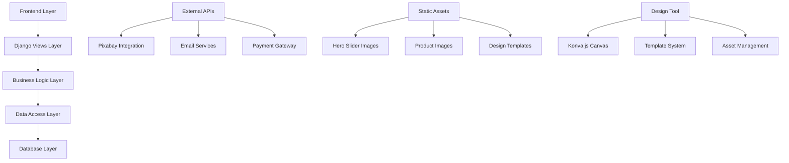
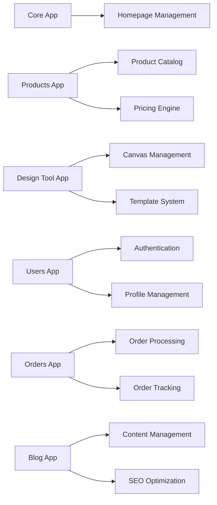

# Design Document

## Overview

This design document outlines the comprehensive enhancement of the Drishti printing service website, transforming it from a basic landing page into a full-featured e-commerce platform. The solution builds upon the existing Django MVT architecture, integrates with the existing Konva.js design tool, leverages Pixabay API for images, and adds extensive new functionality including dynamic content management, product catalog with pricing, user accounts, and SEO optimization.

The enhanced website will serve as a complete printing service platform where customers can browse products, calculate prices, create custom designs, place orders, and track their progress, while administrators can manage all aspects through Django's admin interface.

## Architecture

### System Overview



### Application Structure



## Components and Interfaces

### 1. Homepage Management System

#### Hero Slider Component
```python
class HeroSlide(models.Model):
    title = models.CharField(max_length=200)
    subtitle = models.TextField(blank=True)
    image = models.ImageField(upload_to='hero_slides/')
    background_color = models.CharField(max_length=7, default='#ffffff')
    text_color = models.CharField(max_length=7, default='#000000')
    overlay_opacity = models.FloatField(default=0.3)
    cta_text = models.CharField(max_length=50, blank=True)
    cta_link = models.URLField(blank=True)
    order = models.PositiveIntegerField(default=0)
    is_active = models.BooleanField(default=True)
    start_date = models.DateTimeField(null=True, blank=True)
    end_date = models.DateTimeField(null=True, blank=True)
    
    class Meta:
        ordering = ['order']
```

#### Best Selling Products Component
```python
class ProductMetrics(models.Model):
    product = models.OneToOneField(Product, on_delete=models.CASCADE)
    total_orders = models.PositiveIntegerField(default=0)
    total_revenue = models.DecimalField(max_digits=10, decimal_places=2, default=0)
    last_order_date = models.DateTimeField(null=True)
    is_featured = models.BooleanField(default=False)
    
    @classmethod
    def get_best_selling(cls, limit=4):
        return cls.objects.filter(
            product__is_active=True
        ).order_by('-total_orders', '-total_revenue')[:limit]
```

### 2. Enhanced Product System

#### Product Model Enhancement
```python
class Product(models.Model):
    # Existing fields...
    has_subcategories = models.BooleanField(default=False)
    supports_design_tool = models.BooleanField(default=False)
    supports_upload = models.BooleanField(default=True)
    min_price = models.DecimalField(max_digits=8, decimal_places=2)
    price_calculation_type = models.CharField(
        max_length=20,
        choices=[
            ('fixed', 'Fixed Price'),
            ('calculated', 'Calculated Price'),
            ('quote', 'Quote Required')
        ],
        default='calculated'
    )
    
    def get_subcategories(self):
        return self.subcategories.filter(is_active=True)
    
    def calculate_price(self, specifications):
        # Price calculation logic based on specifications
        pass
```

#### Product Subcategory System
```python
class ProductSubcategory(models.Model):
    parent_product = models.ForeignKey(Product, related_name='subcategories', on_delete=models.CASCADE)
    name = models.CharField(max_length=100)
    description = models.TextField(blank=True)
    image = models.ImageField(upload_to='subcategories/')
    base_price = models.DecimalField(max_digits=8, decimal_places=2)
    is_active = models.BooleanField(default=True)
    order = models.PositiveIntegerField(default=0)
    
    class Meta:
        ordering = ['order']
```

#### Pricing Engine
```python
class PricingRule(models.Model):
    product = models.ForeignKey(Product, on_delete=models.CASCADE)
    subcategory = models.ForeignKey(ProductSubcategory, null=True, blank=True, on_delete=models.CASCADE)
    paper_type = models.CharField(max_length=50)
    size = models.CharField(max_length=50)
    thickness = models.CharField(max_length=50)
    quantity_min = models.PositiveIntegerField()
    quantity_max = models.PositiveIntegerField()
    price_per_unit = models.DecimalField(max_digits=6, decimal_places=2)
    setup_cost = models.DecimalField(max_digits=6, decimal_places=2, default=0)
    
class PricingCalculator:
    @staticmethod
    def calculate_price(product, specifications):
        rules = PricingRule.objects.filter(
            product=product,
            paper_type=specifications.get('paper_type'),
            size=specifications.get('size'),
            thickness=specifications.get('thickness'),
            quantity_min__lte=specifications.get('quantity'),
            quantity_max__gte=specifications.get('quantity')
        ).first()
        
        if rules:
            unit_price = rules.price_per_unit * specifications.get('quantity')
            total_price = unit_price + rules.setup_cost
            return {
                'unit_price': rules.price_per_unit,
                'quantity': specifications.get('quantity'),
                'subtotal': unit_price,
                'setup_cost': rules.setup_cost,
                'total': total_price
            }
        return None
```

### 3. Enhanced Design Tool Integration

#### Design Option Handler
```python
class DesignOption(models.Model):
    product = models.ForeignKey(Product, on_delete=models.CASCADE)
    supports_front_back = models.BooleanField(default=False)
    template_required = models.BooleanField(default=True)
    accepted_formats = models.JSONField(default=list)  # ['pdf', 'png', 'jpg', 'ai', 'psd']
    max_file_size_mb = models.PositiveIntegerField(default=50)
    min_resolution_dpi = models.PositiveIntegerField(default=300)
```

#### Upload Handler
```python
class DesignUpload(models.Model):
    user = models.ForeignKey(User, on_delete=models.CASCADE)
    product = models.ForeignKey(Product, on_delete=models.CASCADE)
    original_filename = models.CharField(max_length=255)
    file = models.FileField(upload_to='design_uploads/')
    file_size = models.PositiveIntegerField()
    file_format = models.CharField(max_length=10)
    resolution_dpi = models.PositiveIntegerField(null=True)
    is_validated = models.BooleanField(default=False)
    validation_errors = models.JSONField(default=list)
    created_at = models.DateTimeField(auto_now_add=True)
    
    def validate_file(self):
        # File validation logic
        pass
```

### 4. User Account System

#### Enhanced User Profile
```python
class UserProfile(models.Model):
    user = models.OneToOneField(User, on_delete=models.CASCADE)
    phone = models.CharField(max_length=15)
    company_name = models.CharField(max_length=100, blank=True)
    default_address = models.ForeignKey('UserAddress', null=True, blank=True, on_delete=models.SET_NULL)
    email_notifications = models.BooleanField(default=True)
    sms_notifications = models.BooleanField(default=False)
    
class UserAddress(models.Model):
    user = models.ForeignKey(User, related_name='addresses', on_delete=models.CASCADE)
    label = models.CharField(max_length=50)  # Home, Office, etc.
    address_line_1 = models.CharField(max_length=255)
    address_line_2 = models.CharField(max_length=255, blank=True)
    city = models.CharField(max_length=100)
    state = models.CharField(max_length=100)
    postal_code = models.CharField(max_length=20)
    country = models.CharField(max_length=100, default='India')
    is_default = models.BooleanField(default=False)
```

#### Design Management
```python
class SavedDesign(models.Model):
    user = models.ForeignKey(User, on_delete=models.CASCADE)
    product = models.ForeignKey(Product, on_delete=models.CASCADE)
    name = models.CharField(max_length=100)
    design_data = models.JSONField()
    thumbnail = models.ImageField(upload_to='design_thumbnails/', null=True)
    is_favorite = models.BooleanField(default=False)
    created_at = models.DateTimeField(auto_now_add=True)
    updated_at = models.DateTimeField(auto_now=True)
    
    def generate_thumbnail(self):
        # Generate thumbnail from design data
        pass
```

### 5. Order Management System

#### Enhanced Order Model
```python
class Order(models.Model):
    STATUS_CHOICES = [
        ('pending', 'Pending'),
        ('confirmed', 'Confirmed'),
        ('in_production', 'In Production'),
        ('quality_check', 'Quality Check'),
        ('ready', 'Ready for Pickup/Shipping'),
        ('shipped', 'Shipped'),
        ('delivered', 'Delivered'),
        ('cancelled', 'Cancelled')
    ]
    
    user = models.ForeignKey(User, on_delete=models.CASCADE)
    order_number = models.CharField(max_length=20, unique=True)
    status = models.CharField(max_length=20, choices=STATUS_CHOICES, default='pending')
    total_amount = models.DecimalField(max_digits=10, decimal_places=2)
    shipping_address = models.ForeignKey(UserAddress, on_delete=models.PROTECT)
    special_instructions = models.TextField(blank=True)
    estimated_delivery = models.DateField(null=True)
    tracking_number = models.CharField(max_length=100, blank=True)
    created_at = models.DateTimeField(auto_now_add=True)
    
    def generate_order_number(self):
        # Generate unique order number
        pass

class OrderItem(models.Model):
    order = models.ForeignKey(Order, related_name='items', on_delete=models.CASCADE)
    product = models.ForeignKey(Product, on_delete=models.CASCADE)
    subcategory = models.ForeignKey(ProductSubcategory, null=True, on_delete=models.CASCADE)
    quantity = models.PositiveIntegerField()
    specifications = models.JSONField()
    unit_price = models.DecimalField(max_digits=8, decimal_places=2)
    total_price = models.DecimalField(max_digits=8, decimal_places=2)
    design_file = models.ForeignKey(DesignUpload, null=True, blank=True, on_delete=models.SET_NULL)
    saved_design = models.ForeignKey(SavedDesign, null=True, blank=True, on_delete=models.SET_NULL)
```

### 6. Blog and SEO System

#### Blog Management
```python
class BlogCategory(models.Model):
    name = models.CharField(max_length=100)
    slug = models.SlugField(unique=True)
    description = models.TextField(blank=True)
    
class BlogPost(models.Model):
    title = models.CharField(max_length=200)
    slug = models.SlugField(unique=True)
    author = models.ForeignKey(User, on_delete=models.CASCADE)
    category = models.ForeignKey(BlogCategory, on_delete=models.CASCADE)
    content = models.TextField()
    excerpt = models.TextField(max_length=300)
    featured_image = models.ImageField(upload_to='blog_images/')
    meta_description = models.CharField(max_length=160)
    meta_keywords = models.CharField(max_length=255)
    is_published = models.BooleanField(default=False)
    publish_date = models.DateTimeField(null=True, blank=True)
    created_at = models.DateTimeField(auto_now_add=True)
    updated_at = models.DateTimeField(auto_now=True)
    
    def get_absolute_url(self):
        return reverse('blog:post_detail', kwargs={'slug': self.slug})
```

### 7. Frontend Components

#### Dynamic Hero Slider
```javascript
class HeroSlider {
    constructor(slides, options = {}) {
        this.slides = slides;
        this.currentSlide = 0;
        this.autoPlay = options.autoPlay || true;
        this.interval = options.interval || 5000;
        this.init();
    }
    
    init() {
        this.createSliderHTML();
        this.bindEvents();
        if (this.autoPlay) {
            this.startAutoPlay();
        }
    }
    
    createSliderHTML() {
        const sliderContainer = document.getElementById('hero-slider');
        this.slides.forEach((slide, index) => {
            const slideElement = this.createSlideElement(slide, index);
            sliderContainer.appendChild(slideElement);
        });
    }
    
    createSlideElement(slide, index) {
        return `
            <div class="slide ${index === 0 ? 'active' : ''}" 
                 style="background-color: ${slide.background_color}; color: ${slide.text_color};">
                <div class="slide-image">
                    
                    <div class="overlay" style="opacity: ${slide.overlay_opacity};"></div>
                </div>
                <div class="slide-content">
                    <h1>${slide.title}</h1>
                    <p>${slide.subtitle}</p>
                    ${slide.cta_text ? `<a href="${slide.cta_link}" class="cta-button">${slide.cta_text}</a>` : ''}
                </div>
            </div>
        `;
    }
}
```

#### Price Calculator Component
```javascript
class PriceCalculator {
    constructor(productId) {
        this.productId = productId;
        this.specifications = {};
        this.init();
    }
    
    init() {
        this.bindEvents();
        this.loadPricingOptions();
    }
    
    bindEvents() {
        document.querySelectorAll('.spec-selector').forEach(selector => {
            selector.addEventListener('change', (e) => {
                this.updateSpecification(e.target.name, e.target.value);
                this.calculatePrice();
            });
        });
    }
    
    async calculatePrice() {
        try {
            const response = await fetch('/api/calculate-price/', {
                method: 'POST',
                headers: {
                    'Content-Type': 'application/json',
                    'X-CSRFToken': this.getCSRFToken()
                },
                body: JSON.stringify({
                    product_id: this.productId,
                    specifications: this.specifications
                })
            });
            
            const data = await response.json();
            this.displayPricing(data);
        } catch (error) {
            console.error('Price calculation failed:', error);
        }
    }
    
    displayPricing(pricing) {
        const priceDisplay = document.getElementById('price-display');
        priceDisplay.innerHTML = `
            <div class="pricing-breakdown">
                <div class="price-line">
                    <span>Unit Price:</span>
                    <span>₹${pricing.unit_price}</span>
                </div>
                <div class="price-line">
                    <span>Quantity (${pricing.quantity}):</span>
                    <span>₹${pricing.subtotal}</span>
                </div>
                ${pricing.setup_cost > 0 ? `
                    <div class="price-line">
                        <span>Setup Cost:</span>
                        <span>₹${pricing.setup_cost}</span>
                    </div>
                ` : ''}
                <div class="price-line total">
                    <span>Total:</span>
                    <span>₹${pricing.total}</span>
                </div>
            </div>
        `;
    }
}
```

#### Design Option Handler
```javascript
class DesignOptionHandler {
    constructor(productId, options) {
        this.productId = productId;
        this.options = options;
        this.init();
    }
    
    init() {
        this.createDesignOptions();
        this.bindEvents();
    }
    
    createDesignOptions() {
        const container = document.getElementById('design-options');
        container.innerHTML = `
            <div class="design-choice-buttons">
                <button class="design-btn upload-btn" data-action="upload">
                    <i class="icon-upload"></i>
                    <span>Upload Design</span>
                    <small>Have your own design ready?</small>
                </button>
                <button class="design-btn create-btn" data-action="create">
                    <i class="icon-design"></i>
                    <span>Design Now</span>
                    <small>Use our design tool</small>
                </button>
            </div>
        `;
    }
    
    bindEvents() {
        document.querySelectorAll('.design-btn').forEach(btn => {
            btn.addEventListener('click', (e) => {
                const action = e.currentTarget.dataset.action;
                if (action === 'upload') {
                    this.showUploadModal();
                } else if (action === 'create') {
                    this.showDesignOptions();
                }
            });
        });
    }
    
    showDesignOptions() {
        if (this.options.supports_front_back) {
            this.showSideSelectionModal();
        } else {
            this.redirectToDesignTool();
        }
    }
    
    showSideSelectionModal() {
        const modal = document.createElement('div');
        modal.className = 'modal side-selection-modal';
        modal.innerHTML = `
            <div class="modal-content">
                <h3>Choose Design Option</h3>
                <div class="side-options">
                    <button class="side-btn" data-side="front">Design Front Only</button>
                    <button class="side-btn" data-side="back">Design Back Only</button>
                    <button class="side-btn" data-side="both">Design Both Sides</button>
                </div>
                <button class="close-modal">Cancel</button>
            </div>
        `;
        
        document.body.appendChild(modal);
        this.bindModalEvents(modal);
    }
}
```

## Data Models

### Core Models Summary

1. **HeroSlide**: Dynamic homepage slider management
2. **ProductMetrics**: Best-selling product tracking
3. **ProductSubcategory**: Product hierarchy management
4. **PricingRule**: Flexible pricing calculation system
5. **DesignOption**: Design tool configuration per product
6. **DesignUpload**: File upload management and validation
7. **UserProfile & UserAddress**: Enhanced user management
8. **SavedDesign**: User design storage and management
9. **Order & OrderItem**: Complete order processing system
10. **BlogPost & BlogCategory**: SEO-friendly blog system

## Error Handling

### Validation and Error Management

#### File Upload Validation
```python
class FileValidator:
    @staticmethod
    def validate_design_file(file, product):
        errors = []
        
        # File size validation
        if file.size > product.designoption.max_file_size_mb * 1024 * 1024:
            errors.append(f"File size exceeds {product.designoption.max_file_size_mb}MB limit")
        
        # Format validation
        file_extension = file.name.split('.')[-1].lower()
        if file_extension not in product.designoption.accepted_formats:
            errors.append(f"File format {file_extension} not supported")
        
        # Resolution validation for images
        if file_extension in ['jpg', 'jpeg', 'png']:
            # Check DPI if possible
            pass
        
        return errors
```

#### Price Calculation Error Handling
```python
class PricingErrorHandler:
    @staticmethod
    def handle_calculation_error(product, specifications, error):
        return {
            'success': False,
            'error': 'Unable to calculate price',
            'message': 'Please contact us for a custom quote',
            'contact_info': {
                'phone': settings.BUSINESS_PHONE,
                'email': settings.BUSINESS_EMAIL
            }
        }
```

## Testing Strategy

### Unit Tests
1. **Model Tests**: Validate all model relationships and business logic
2. **Price Calculator Tests**: Test pricing calculations with various scenarios
3. **File Upload Tests**: Test file validation and processing
4. **User Authentication Tests**: Test registration, login, and profile management

### Integration Tests
1. **Order Flow Tests**: Complete order placement and processing
2. **Design Tool Integration**: Test design tool with product configuration
3. **Email Notification Tests**: Test all automated email triggers
4. **API Endpoint Tests**: Test all AJAX endpoints and responses

### Frontend Tests
1. **Hero Slider Tests**: Test slider functionality and responsiveness
2. **Price Calculator Tests**: Test real-time price calculations
3. **Design Option Tests**: Test upload and design tool integration
4. **Mobile Responsiveness**: Test on various device sizes

### Performance Tests
1. **Page Load Speed**: Ensure sub-3-second load times
2. **Image Optimization**: Test image compression and lazy loading
3. **Database Query Optimization**: Monitor and optimize slow queries
4. **Concurrent User Testing**: Test system under load

## Implementation Phases

### Phase 1: Core Infrastructure (Weeks 1-2)
- Database schema updates and migrations
- Enhanced models and admin interfaces
- Basic homepage with hero slider
- Product catalog structure

### Phase 2: Product and Pricing System (Weeks 3-4)
- Product subcategory implementation
- Pricing calculation engine
- Product detail pages
- Price calculator frontend

### Phase 3: Design Tool Integration (Weeks 5-6)
- Design option configuration
- Upload functionality
- Integration with existing design tool
- Front/back design selection

### Phase 4: User Accounts and Orders (Weeks 7-8)
- User registration and authentication
- Profile management
- Order placement and tracking
- Email notification system

### Phase 5: Blog and SEO (Weeks 9-10)
- Blog management system
- SEO optimization
- Content management interface
- Search functionality

### Phase 6: Testing and Polish (Weeks 11-12)
- Comprehensive testing
- Performance optimization
- Mobile responsiveness refinement
- Documentation and training

Each phase includes thorough testing and user acceptance validation before proceeding to the next phase.