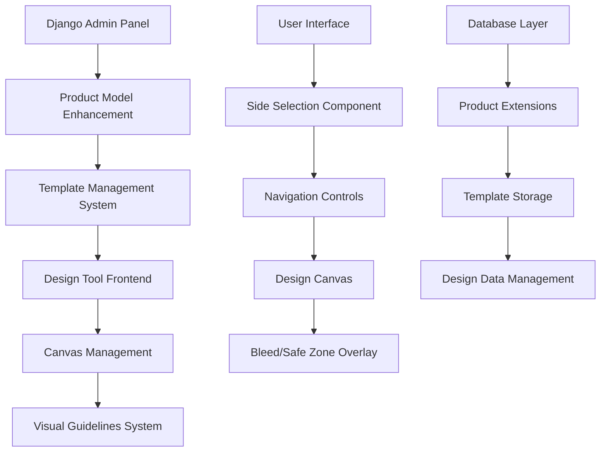

# Design Document

## Overview

This design document outlines the implementation of front/back design capabilities for the existing design tool. The enhancement will allow administrators to enable dual-sided design for specific products, upload separate templates for front and back sides, and provide users with an intuitive interface to design both sides with proper visual guidelines.

The solution builds upon the existing Django-based design tool that uses Konva.js for canvas manipulation and maintains backward compatibility with current single-sided products.

## Architecture

### System Components



### Data Flow

1. **Admin Configuration**: Administrator enables front/back design for products and uploads templates
2. **User Selection**: User selects design options (front only, back only, or both sides)
3. **Canvas Initialization**: System loads appropriate templates and initializes canvas(es)
4. **Design Process**: User designs with visual guidelines (bleed lines and safe zones)
5. **Side Navigation**: User switches between front and back views seamlessly
6. **Data Persistence**: System saves design data for both sides independently

## Components and Interfaces

### 1. Database Schema Extensions

#### Product Model Enhancement
```python
class Product(models.Model):
    # Existing fields...
    front_back_design_enabled = models.BooleanField(default=False)
    
    def has_front_template(self):
        return self.design_templates.filter(side='front', status='active').exists()
    
    def has_back_template(self):
        return self.design_templates.filter(side='back', status='active').exists()
```

#### DesignTemplate Model Enhancement
```python
class DesignTemplate(models.Model):
    # Existing fields...
    SIDE_CHOICES = [
        ('front', 'Front'),
        ('back', 'Back'),
        ('single', 'Single Side'),  # For backward compatibility
    ]
    side = models.CharField(max_length=10, choices=SIDE_CHOICES, default='single')
    
    class Meta:
        unique_together = ['product', 'side', 'name']
```

#### UserDesign Model Enhancement
```python
class UserDesign(models.Model):
    # Existing fields...
    DESIGN_TYPE_CHOICES = [
        ('single', 'Single Side'),
        ('front_only', 'Front Only'),
        ('back_only', 'Back Only'),
        ('both_sides', 'Both Sides'),
    ]
    design_type = models.CharField(max_length=15, choices=DESIGN_TYPE_CHOICES, default='single')
    front_design_data = models.JSONField(null=True, blank=True)
    back_design_data = models.JSONField(null=True, blank=True)
    
    # Maintain backward compatibility
    @property
    def design_data(self):
        if self.design_type == 'single':
            return super().design_data
        return {
            'front': self.front_design_data,
            'back': self.back_design_data,
            'type': self.design_type
        }
```

### 2. Admin Interface Components

#### Product Admin Enhancement
```python
class ProductAdmin(admin.ModelAdmin):
    fieldsets = [
        # Existing fieldsets...
        ('Design Tool Settings', {
            'fields': ('design_tool_enabled', 'front_back_design_enabled'),
            'classes': ('collapse',)
        }),
    ]
    
    def get_form(self, request, obj=None, **kwargs):
        form = super().get_form(request, obj, **kwargs)
        if obj and not obj.design_tool_enabled:
            form.base_fields['front_back_design_enabled'].widget.attrs['disabled'] = True
        return form
```

#### Template Admin Enhancement
```python
class DesignTemplateAdmin(admin.ModelAdmin):
    list_display = ['name', 'category', 'side', 'status', 'created_at']
    list_filter = ['side', 'status', 'category']
    fieldsets = [
        (None, {
            'fields': ('name', 'category', 'side', 'product_types')
        }),
        ('Template Data', {
            'fields': ('template_file', 'template_data', 'description')
        }),
        ('Specifications', {
            'fields': ('width', 'height', 'dpi', 'bleed_mm', 'safe_area_mm')
        }),
    ]
```

### 3. Frontend Components

#### Side Selection Component
```javascript
class SideSelectionComponent {
    constructor(product, availableTemplates) {
        this.product = product;
        this.availableTemplates = availableTemplates;
        this.selectedSides = [];
    }
    
    render() {
        const options = this.getAvailableOptions();
        return this.createSelectionUI(options);
    }
    
    getAvailableOptions() {
        const hasFront = this.availableTemplates.some(t => t.side === 'front');
        const hasBack = this.availableTemplates.some(t => t.side === 'back');
        
        const options = [];
        if (hasFront) options.push({ value: 'front_only', label: 'Front Only' });
        if (hasBack) options.push({ value: 'back_only', label: 'Back Only' });
        if (hasFront && hasBack) options.push({ value: 'both_sides', label: 'Both Sides' });
        
        return options;
    }
}
```

#### Canvas Manager Enhancement
```javascript
class CanvasManager {
    constructor(config) {
        this.canvases = {};
        this.currentSide = 'front';
        this.config = config;
        this.visualGuides = new VisualGuidesOverlay(config);
    }
    
    initializeCanvas(side, templateData) {
        const canvas = new Konva.Stage({
            container: `canvas-${side}`,
            width: this.config.width_px,
            height: this.config.height_px
        });
        
        this.canvases[side] = canvas;
        this.visualGuides.addToCanvas(canvas, side);
        
        if (templateData) {
            this.loadTemplate(side, templateData);
        }
    }
    
    switchSide(side) {
        this.hideCanvas(this.currentSide);
        this.showCanvas(side);
        this.currentSide = side;
        this.updateUI();
    }
}
```

#### Visual Guidelines System
```javascript
class VisualGuidesOverlay {
    constructor(config) {
        this.config = config;
        this.bleedColor = '#ff0000';  // Red for bleed lines
        this.safeZoneColor = '#000000';  // Black for safe zones
    }
    
    addToCanvas(canvas, side) {
        const guidesLayer = new Konva.Layer({ name: 'visual-guides' });
        
        // Add bleed lines
        this.addBleedLines(guidesLayer);
        
        // Add safe zone
        this.addSafeZone(guidesLayer);
        
        canvas.add(guidesLayer);
        guidesLayer.moveToTop();
    }
    
    addBleedLines(layer) {
        const bleedPx = this.mmToPx(this.config.bleed_mm);
        
        const bleedRect = new Konva.Rect({
            x: -bleedPx,
            y: -bleedPx,
            width: this.config.width_px + (bleedPx * 2),
            height: this.config.height_px + (bleedPx * 2),
            stroke: this.bleedColor,
            strokeWidth: 2,
            dash: [5, 5],
            listening: false
        });
        
        layer.add(bleedRect);
    }
    
    addSafeZone(layer) {
        const safeMarginPx = this.mmToPx(this.config.safe_area_mm);
        
        const safeRect = new Konva.Rect({
            x: safeMarginPx,
            y: safeMarginPx,
            width: this.config.width_px - (safeMarginPx * 2),
            height: this.config.height_px - (safeMarginPx * 2),
            stroke: this.safeZoneColor,
            strokeWidth: 1,
            dash: [3, 3],
            listening: false
        });
        
        layer.add(safeRect);
    }
}
```

### 4. API Interfaces

#### Enhanced Save Design API
```python
@require_http_methods(["POST"])
@csrf_exempt
def save_design_api(request):
    data = json.loads(request.body)
    
    design_type = data.get('design_type', 'single')
    front_data = data.get('front_design_data')
    back_data = data.get('back_design_data')
    
    design = UserDesign.objects.create(
        user=request.user,
        product=product,
        name=data.get('name'),
        design_type=design_type,
        front_design_data=front_data,
        back_design_data=back_data
    )
    
    return JsonResponse({
        'success': True,
        'design_id': str(design.id)
    })
```

#### Template Loading API
```python
@require_http_methods(["GET"])
def get_templates_for_product(request, product_id):
    product = get_object_or_404(Product, id=product_id)
    
    templates = {
        'front': [],
        'back': [],
        'single': []
    }
    
    for template in product.design_templates.filter(status='active'):
        templates[template.side].append({
            'id': str(template.id),
            'name': template.name,
            'side': template.side,
            'template_data': template.template_data,
            'preview_url': template.preview_image.url if template.preview_image else None
        })
    
    return JsonResponse({
        'success': True,
        'templates': templates,
        'front_back_enabled': product.front_back_design_enabled
    })
```

## Data Models

### Enhanced Product Model
- `front_back_design_enabled`: Boolean flag to enable/disable front-back design
- Validation to ensure at least one template exists when enabled
- Helper methods to check template availability

### Enhanced DesignTemplate Model
- `side`: Enum field ('front', 'back', 'single')
- Unique constraint on product + side + name combination
- Backward compatibility with existing single-sided templates

### Enhanced UserDesign Model
- `design_type`: Enum field for design type selection
- `front_design_data`: JSON field for front side design
- `back_design_data`: JSON field for back side design
- Property method for backward compatibility

## Error Handling

### Validation Rules
1. **Product Configuration**: Front/back design can only be enabled if design tool is enabled
2. **Template Requirements**: At least one template (front or back) must exist for enabled products
3. **Design Type Validation**: Selected design type must match available templates
4. **Data Integrity**: Design data must be valid JSON and contain required canvas properties

### Error Scenarios
1. **Missing Templates**: Graceful fallback to available templates with user notification
2. **Invalid Design Data**: Validation and sanitization of canvas data
3. **Template Loading Failures**: Fallback to default template or empty canvas
4. **Save Failures**: Retry mechanism with user feedback

### Error Messages
```javascript
const ERROR_MESSAGES = {
    NO_TEMPLATES: 'No templates available for this product configuration.',
    INVALID_SELECTION: 'Selected design option is not available for this product.',
    SAVE_FAILED: 'Failed to save design. Please try again.',
    LOAD_FAILED: 'Failed to load template. Using default canvas.',
    NETWORK_ERROR: 'Network error. Please check your connection and try again.'
};
```

## Testing Strategy

### Unit Tests
1. **Model Tests**: Validate product configuration, template relationships, and design data integrity
2. **API Tests**: Test all endpoints for proper request/response handling and error cases
3. **Component Tests**: Test frontend components in isolation

### Integration Tests
1. **Admin Workflow**: Test complete admin configuration flow
2. **User Design Flow**: Test end-to-end user design creation and saving
3. **Template Management**: Test template upload, validation, and loading

### UI Tests
1. **Side Selection**: Test all selection scenarios and edge cases
2. **Canvas Switching**: Test seamless navigation between front and back
3. **Visual Guidelines**: Test bleed lines and safe zones display correctly
4. **Responsive Design**: Test on different screen sizes and devices

### Performance Tests
1. **Canvas Loading**: Test performance with large templates and complex designs
2. **Memory Usage**: Monitor memory consumption during side switching
3. **API Response Times**: Ensure acceptable response times for all endpoints

### Browser Compatibility
- Chrome 90+
- Firefox 88+
- Safari 14+
- Edge 90+

## Implementation Phases

### Phase 1: Backend Foundation
1. Database schema updates
2. Model enhancements
3. Admin interface updates
4. Basic API endpoints

### Phase 2: Frontend Core
1. Side selection component
2. Canvas manager enhancements
3. Template loading system
4. Basic navigation between sides

### Phase 3: Visual Guidelines
1. Bleed lines implementation
2. Safe zone indicators
3. Visual feedback system
4. Responsive overlay system

### Phase 4: Integration & Polish
1. Complete user workflow testing
2. Error handling improvements
3. Performance optimizations
4. Documentation and training materials

Each phase includes comprehensive testing and validation before proceeding to the next phase.