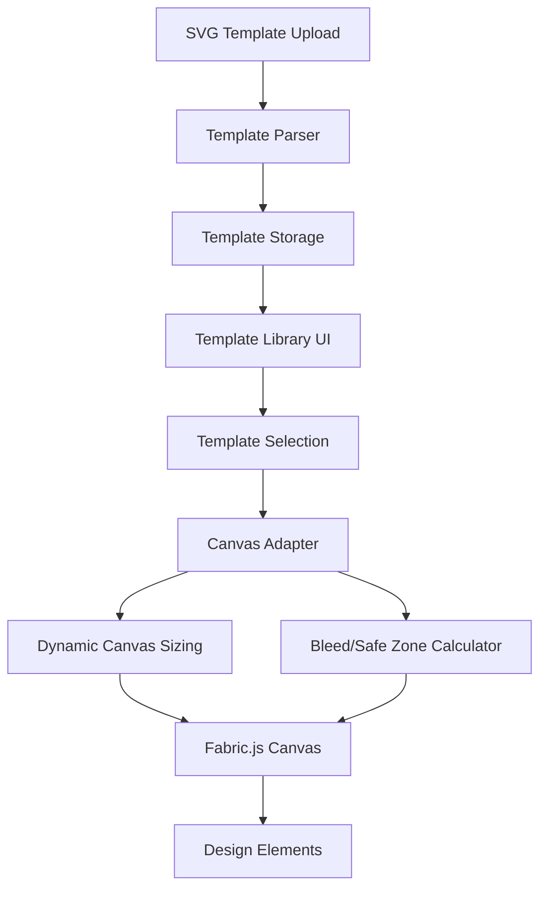

# Design Document

## Overview

The SVG Template Integration feature extends the existing design tool to support uploaded SVG templates with dynamic canvas sizing and adaptive bleed/safe zone management. The system will integrate with the current Fabric.js-based canvas implementation and enhance the existing template management system to provide a seamless template-driven design experience.

## Architecture

### High-Level Architecture



### Integration Points

The feature integrates with existing systems:

1. **Current Canvas System**: Extends the existing Fabric.js canvas implementation
2. **Template Management**: Enhances the existing template upload and storage system
3. **Guide System**: Builds upon the current bleed line and safe zone implementation
4. **Ruler System**: Adapts the existing ruler system for dynamic dimensions

## Components and Interfaces

### 1. SVG Template Parser

**Purpose**: Parse uploaded SVG files to extract dimensions, metadata, and validate structure.

**Interface**:
```javascript
class SVGTemplateParser {
    parseTemplate(svgFile) {
        // Returns: { width, height, viewBox, metadata, isValid, errors }
    }
    
    extractDimensions(svgContent) {
        // Returns: { width, height, units }
    }
    
    validateSVG(svgContent) {
        // Returns: { isValid, errors[] }
    }
    
    extractMetadata(svgContent) {
        // Returns: { bleed, safeZone, title, description }
    }
}
```

**Key Features**:
- Parse SVG width/height attributes and viewBox
- Extract embedded bleed/safe zone metadata from SVG comments or custom attributes
- Validate SVG structure and compatibility
- Support multiple unit systems (mm, px, inches)

### 2. Template Storage Manager

**Purpose**: Manage template storage, retrieval, and organization.

**Interface**:
```javascript
class TemplateStorageManager {
    saveTemplate(templateData) {
        // Saves template to localStorage/IndexedDB
    }
    
    getTemplates(filters = {}) {
        // Returns filtered template list
    }
    
    deleteTemplate(templateId) {
        // Removes template from storage
    }
    
    generateThumbnail(svgContent) {
        // Creates preview thumbnail
    }
}
```

**Storage Schema**:
```javascript
{
    id: 'unique-template-id',
    name: 'Template Name',
    svgContent: '<svg>...</svg>',
    dimensions: { width: 90, height: 54, units: 'mm' },
    bleed: { top: 3, right: 3, bottom: 3, left: 3 },
    safeZone: { top: 2, right: 2, bottom: 2, left: 2 },
    thumbnail: 'data:image/png;base64,...',
    uploadDate: '2024-01-01T00:00:00Z',
    category: 'business-cards'
}
```

### 3. Canvas Adapter

**Purpose**: Adapt the canvas to template dimensions and manage template background.

**Interface**:
```javascript
class CanvasAdapter {
    applyTemplate(template) {
        // Resizes canvas and applies template background
    }
    
    resizeCanvas(width, height) {
        // Dynamically resizes the Fabric.js canvas
    }
    
    setTemplateBackground(svgContent) {
        // Sets SVG as non-editable background layer
    }
    
    clearTemplate() {
        // Removes template and resets to default dimensions
    }
}
```

**Key Features**:
- Smooth canvas resizing with animation
- Template background as locked layer
- Maintain design elements during template changes
- Responsive canvas positioning

### 4. Guide System Adapter

**Purpose**: Calculate and display adaptive bleed lines and safe zones.

**Interface**:
```javascript
class GuideSystemAdapter {
    calculateBleedLines(canvasWidth, canvasHeight, bleedConfig) {
        // Returns bleed line coordinates
    }
    
    calculateSafeZones(canvasWidth, canvasHeight, safeZoneConfig) {
        // Returns safe zone coordinates
    }
    
    updateGuides(template) {
        // Updates all guide lines for new template
    }
    
    toggleGuideVisibility(guideType, visible) {
        // Shows/hides specific guide types
    }
}
```

**Guide Calculation Logic**:
- Convert template dimensions to canvas pixels
- Apply bleed/safe zone margins based on template specifications
- Handle different unit systems (mm to px conversion)
- Maintain guide proportions during zoom operations

### 5. Template Library UI

**Purpose**: Provide interface for template selection and management.

**Interface**:
```javascript
class TemplateLibraryUI {
    renderTemplateGrid(templates) {
        // Displays template thumbnails in grid
    }
    
    showTemplateDetails(template) {
        // Shows template information modal
    }
    
    handleTemplateSelection(template) {
        // Applies selected template to canvas
    }
    
    showUploadDialog() {
        // Opens template upload interface
    }
}
```

**UI Components**:
- Template grid with thumbnails and metadata
- Search and filter functionality
- Template details modal
- Upload progress indicator
- Template management controls

## Data Models

### Template Model
```javascript
class Template {
    constructor(data) {
        this.id = data.id || generateUniqueId();
        this.name = data.name;
        this.svgContent = data.svgContent;
        this.dimensions = data.dimensions;
        this.bleed = data.bleed || { top: 3, right: 3, bottom: 3, left: 3 };
        this.safeZone = data.safeZone || { top: 2, right: 2, bottom: 2, left: 2 };
        this.thumbnail = data.thumbnail;
        this.uploadDate = data.uploadDate || new Date().toISOString();
        this.category = data.category || 'uncategorized';
    }
    
    getDimensionsInPixels(dpi = 300) {
        // Convert dimensions to pixels based on DPI
    }
    
    getBleedInPixels(dpi = 300) {
        // Convert bleed margins to pixels
    }
    
    getSafeZoneInPixels(dpi = 300) {
        // Convert safe zone margins to pixels
    }
}
```

### Canvas Configuration Model
```javascript
class CanvasConfiguration {
    constructor() {
        this.template = null;
        this.dimensions = { width: 350, height: 200 }; // Default
        this.bleed = { top: 3, right: 3, bottom: 3, left: 3 };
        this.safeZone = { top: 2, right: 2, bottom: 2, left: 2 };
        this.units = 'mm';
        this.dpi = 300;
        this.showBleed = true;
        this.showSafeZone = true;
    }
    
    applyTemplate(template) {
        // Updates configuration based on template
    }
    
    resetToDefault() {
        // Resets to default configuration
    }
}
```

## Error Handling

### SVG Validation Errors
- **Invalid SVG Format**: Display user-friendly error message and reject upload
- **Missing Dimensions**: Use default dimensions and warn user
- **Unsupported Features**: Parse what's possible and warn about unsupported elements
- **File Size Limits**: Enforce reasonable file size limits and provide feedback

### Canvas Adaptation Errors
- **Dimension Conflicts**: Gracefully handle extreme dimensions with warnings
- **Memory Constraints**: Limit maximum canvas size to prevent browser crashes
- **Rendering Issues**: Fallback to simplified rendering if complex SVG causes problems

### Storage Errors
- **Storage Quota**: Handle localStorage/IndexedDB quota exceeded scenarios
- **Corruption**: Validate stored templates and remove corrupted entries
- **Migration**: Handle schema changes in stored template data

## Testing Strategy

### Unit Tests
1. **SVG Parser Tests**
   - Valid SVG parsing with various dimension formats
   - Invalid SVG handling and error reporting
   - Metadata extraction from different SVG structures
   - Unit conversion accuracy

2. **Canvas Adapter Tests**
   - Canvas resizing with different aspect ratios
   - Template background application and removal
   - Design element preservation during template changes
   - Performance with large templates

3. **Guide System Tests**
   - Bleed line calculation accuracy
   - Safe zone positioning correctness
   - Unit conversion precision
   - Guide visibility toggling

### Integration Tests
1. **Template Upload Flow**
   - End-to-end template upload and application
   - Template library updates after upload
   - Canvas adaptation after template selection

2. **Canvas Interaction Tests**
   - Design element manipulation with templates
   - Zoom and pan functionality with adaptive guides
   - Template switching with existing designs

### Performance Tests
1. **Large Template Handling**
   - Memory usage with complex SVG templates
   - Rendering performance with detailed templates
   - Canvas responsiveness during template changes

2. **Storage Performance**
   - Template library loading speed
   - Search and filter performance
   - Thumbnail generation efficiency

### User Experience Tests
1. **Template Discovery**
   - Template search and filtering usability
   - Template preview and selection flow
   - Upload process user experience

2. **Design Workflow**
   - Template-based design creation workflow
   - Guide system usability and clarity
   - Canvas adaptation smoothness

## Implementation Phases

### Phase 1: Core SVG Processing
- SVG parser implementation
- Basic template storage
- Canvas dimension adaptation

### Phase 2: Guide System Integration
- Adaptive bleed line calculation
- Dynamic safe zone positioning
- Guide visibility controls

### Phase 3: Template Library UI
- Template grid interface
- Upload dialog implementation
- Template management features

### Phase 4: Advanced Features
- Template metadata extraction
- Advanced search and filtering
- Performance optimizations

### Phase 5: Polish and Testing
- Comprehensive testing suite
- Error handling refinement
- User experience improvements